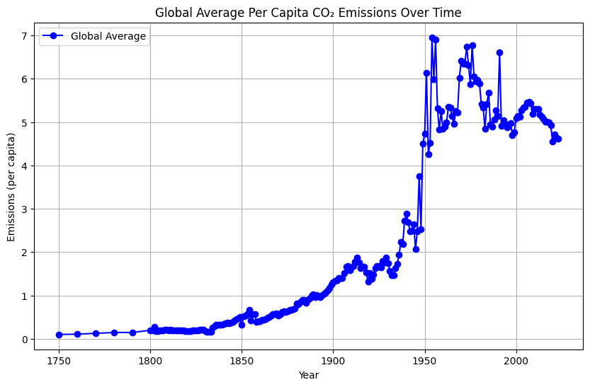
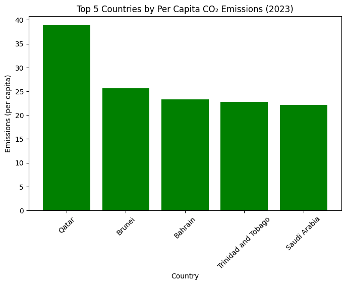

# Global-CO2-Emissions-Analysis
Analyze and visualize how per capita CO₂ emissions have changed over time for individual countries and globally.

## Visualizations

### 1. Global Average Per Capita CO₂ Emissions Over Time

Observation:

The global average per capita CO₂ emissions have steadily increased from the 19th century to the mid-20th century, with a significant rise during the industrial revolution. After peaking in the 1960s–1980s, emissions have shown fluctuations but no clear decline, highlighting the ongoing reliance on fossil fuels.

Implication:

The rapid increase during the industrial era correlates with industrialization and urbanization. Despite advancements in renewable energy, global emissions remain a pressing issue.

### 2. Top 5 Countries by Per Capita CO₂ Emissions (2023)

Observation:

Qatar has the highest per capita CO₂ emissions in 2023, followed by Brunei, Bahrain, Trinidad and Tobago, and Saudi Arabia. These countries share common factors: smaller populations, high dependency on oil and gas industries, and affluent lifestyles.

Implication:

The high per capita emissions in these countries emphasize the environmental challenges of wealth combined with fossil fuel-driven economies.

### 3. Per Capita CO₂ Emissions Trend: Afghanistan

Observation:

Afghanistan’s per capita CO₂ emissions increased gradually from the 1950s to 1980, reflecting industrial and economic developments. There’s a noticeable dip in emissions around the 1990s–2000s, potentially due to political instability and reduced industrial activity. Emissions show a modest rise after 2010, indicating slow recovery in economic activities.

Implication:

Political and economic stability play a significant role in a country's emissions trends. Afghanistan's low emissions per capita highlight its limited contribution to global CO₂ levels despite its challenges.

